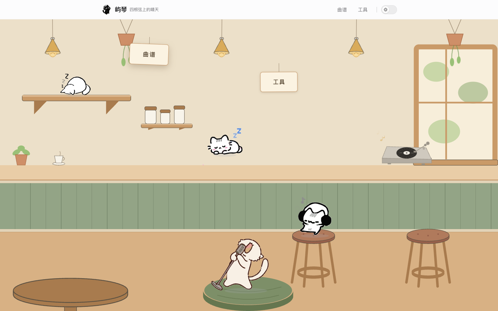
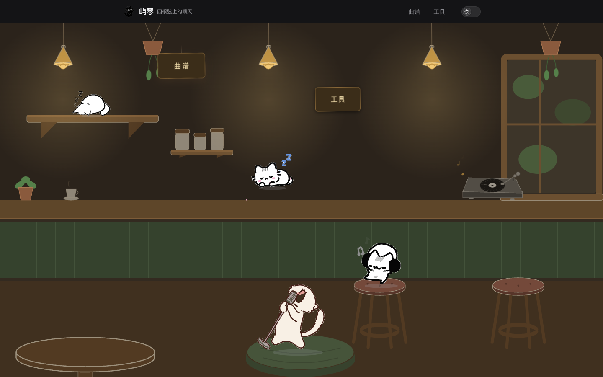
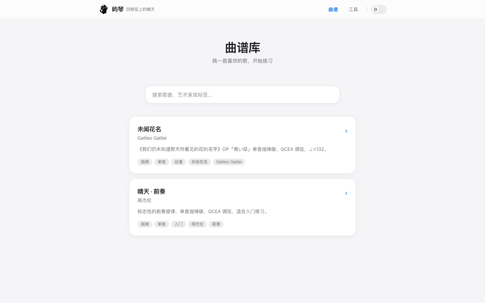
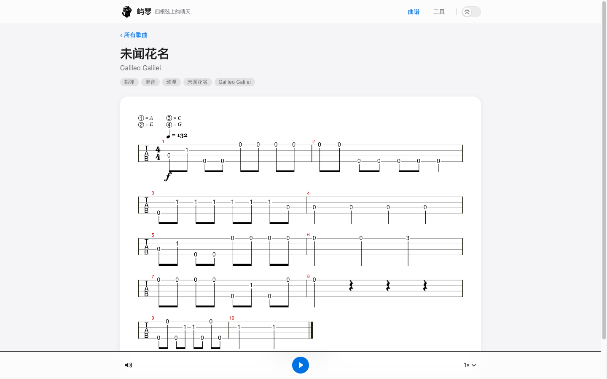
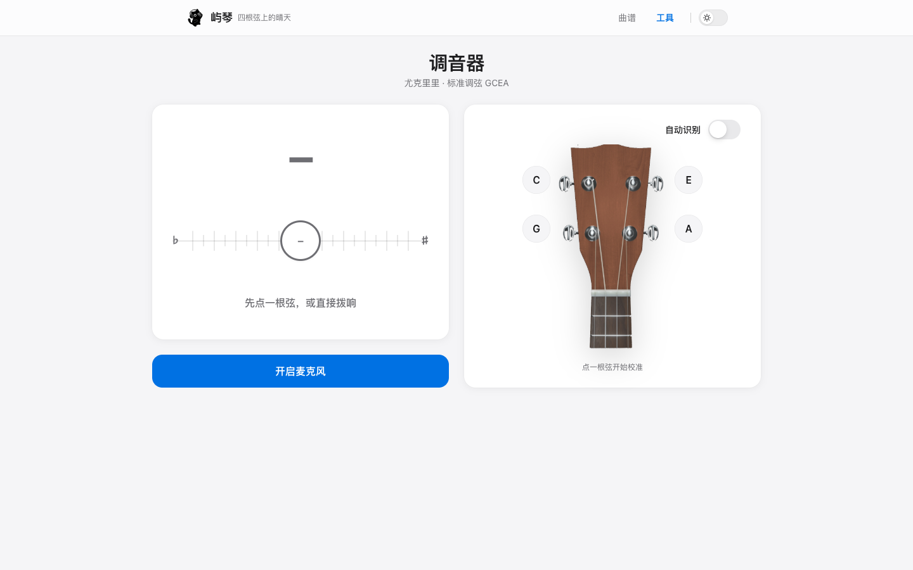
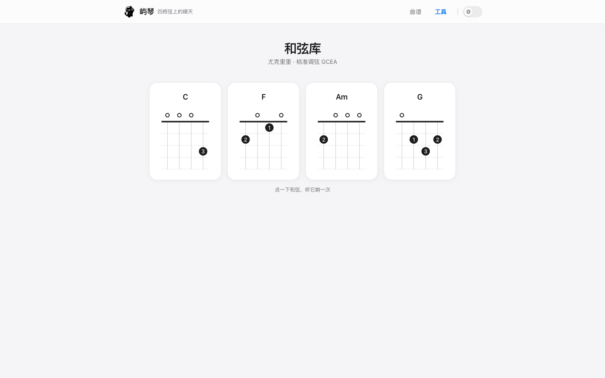
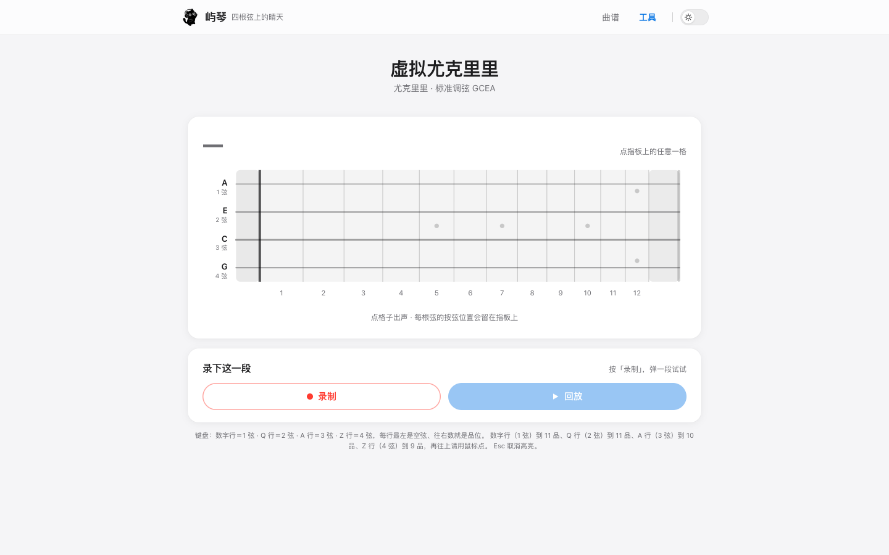
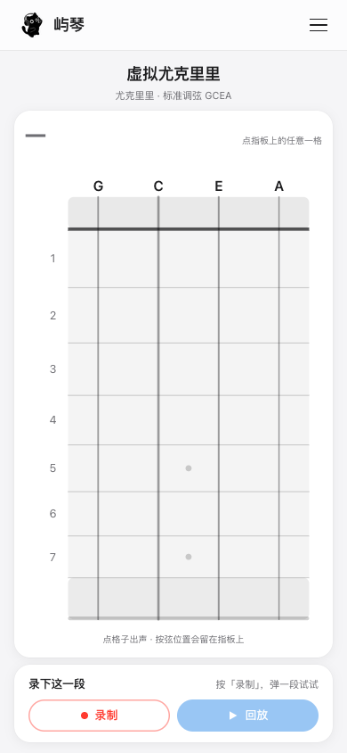

# Yuqin · Ukulele Learning Site

> A sunny day on four strings

A **fully static, backend-free** ukulele learning site — reading scores, hearing them, practising, and tuning, all in one place. Built with React 18 + Vite 7 + TypeScript + Tailwind v4; the build output drops onto any static host as-is.

[中文](README.md) · [Glossary](CONTEXT.md) · [Architecture Decision Records](docs/adr/)



---

## What's inside

| Module | Route | Description |
| --- | --- | --- |
| Song library | `/songs` | Instant local filtering by title / artist / tag. The catalogue is generated at build time by scanning the `songs/` directory — adding a song touches no registry code |
| Song detail | `/song/:id` | alphaTab renders the **4-line TAB staff** with a player bar (play / pause / mute / speed / beat highlight). No original recordings are used: the score itself is the sound source |
| Tuner | `/tools/tuner` | Real-time pitch detection from the microphone (Web Audio autocorrelation). **Manual pick-a-string and auto-detect** are mutually exclusive modes; a cents dial plus a headstock string picker, with each tuned string holding its green dot |
| Chord library | `/tools/chords` | Fingerings for C / F / Am / G (hand-drawn SVG) with tap-to-audition. The dots lighting up and the audio share one timing conversion, so the picture and the sound can never drift apart |
| Virtual ukulele | `/tools/uke` | Play by tapping the fretboard or with the keyboard, with record & replay and a key legend. On a portrait phone the fretboard rotates vertical and the whole page locks to one screen |

Also: **light / dark themes** across the site (follows the system on first visit, remembers your manual choice afterwards), a frosted-glass sticky nav, and a single icon entry point for the whole app.

## Screenshots

| Home (light) | Home (dark) |
| --- | --- |
|  |  |
| **Song library** | **Song detail** |
|  |  |
| **Tuner** | **Chord library** |
|  |  |
| **Virtual ukulele (desktop)** | **Virtual ukulele (portrait phone)** |
|  |  |

## Getting started

Requirements: **Node ≥ 20.19** (the minimum for Vite 7). Package manager: **pnpm**.

```bash
pnpm install      
pnpm dev            # dev server → http://localhost:5173
```

Build and preview:

```bash
pnpm build          # tsc -b && vite build → dist/
pnpm preview        # preview the built dist/ locally
pnpm analyze        # bundle analysis → dist/stats.html (not produced by a normal build)
```

Deployment: `dist/` is plain static output — host it anywhere. Routing uses a **HashRouter** (`/#/songs`), so you need **no server-side rewrite rules** and there is no 404 page to configure.

## Tech stack

| Layer | Choice |
| --- | --- |
| Score rendering & playback | `@coderline/alphatab` 1.8.4 (built-in SoundFont player, lazily imported as its own chunk) |
| Framework | React 18 + `react-router-dom` 6 (HashRouter) |
| Build | Vite 7 + TypeScript 5.9 |
| Styling | Tailwind v4 (`@tailwindcss/vite`) + CSS-variable theme tokens |
| State | Zustand 5 |
| Icons | `lucide-react`; anything the library lacks is hand-written inline in `src/components/icons/index.tsx` |

## Project layout

```
songs/                    Score data — one folder per song
  <id>/meta.json            title / artist / tags / description
  <id>/score.tex            the alphaTex score (hand-written, or generated)
  <id>/melody.txt           optional numbered-notation input (see docs/score-spec.md)
src/
  config/site.config.ts ★ every site-level knob (appearance / playback / nav / chords / ukulele / tuner)
  pages/                  7 pages
  components/             UI parts (chords / tuner / uke / icons subfolders)
  hooks/                  players and audio wiring (useSynthFx / useTuner / useChordPlayer / useUkulelePlayer / useUkuleleRecording)
  lib/                    page-agnostic logic (synthFx / pitch / chord / ukulele / ukeKeys / songTex / catMotion)
  data/                   cat skeleton **metadata** (cats.ts, generated) + hand-written geometry delivery (catArt.ts)
  assets/cats/*.svg       cat skeleton **geometry** (generated, one file per pose, readable and diffable)
  store/                  Zustand: themeStore / playerStore
  songs/index.ts          scans songs/ at build time to build the catalogue
public/
  font/  images/  soundfont/  icons/
docs/
  adr/                    12 architecture decision records
  images/                 README screenshots
  alphatex.md             alphaTex cheat-sheet
  score-spec.md           numbered-notation spec (used by python3 .agents/skills/uke-scoregen/scripts/scoregen.py)
  musicxml-sources.md     where to find scores (source tiers / licensing)
scripts/                  site tools: verify-tex.mjs (tex:verify); musicxml2tex.py is a symlink into the skill
.agents/skills/
  uke-scoregen/           project skill (one self-contained package): notation → score, ships scoregen.py + musicxml2tex.py
  bitmap-to-svg-replica/  pixel-faithful bitmap → SVG tracing, then rig + normalise into animation skeletons
  svg-character-motion/   engineering conventions and pitfalls for skeleton → deterministic motion engine
  disney-animation-rule-skill/  the 12 animation principles turned into executable rules
CONTEXT.md                domain glossary (read this before changing code)
```

Skills live for real in **`.agents/skills/`** (that folder is committed); WorkBuddy's discovery
path `.workbuddy/skills/<name>` is a **symlink** pointing at it (`.workbuddy` is in `.gitignore`).
Every skill is a self-contained package (its scripts live only inside its own folder), so moving
the whole folder never breaks anything; `uke-scoregen`'s `musicxml2tex.py` is also used by
`pnpm tex:from-xml`, which is why `scripts/` keeps a symlink to it.

## Configuration

Every site-level knob lives in ★ **`src/config/site.config.ts`**, grouped by purpose:

| Block | Covers | Notable keys |
| --- | --- | --- |
| `theme` | Appearance | `defaultMode` (`system` / `light` / `dark`), `storageKey` |
| `player` | Score playback & layout | `defaultSpeed`, `speedOptions`, `barsPerRow` (2) / `barsPerRowMobile` (1), `equalBarWidth`, `scale`, `beatHighlight`, `instrument`, `fx` |
| `chords` | Chord library | `items` (add/remove chords), `strumSpreadMs` (160), `ringSeconds` (2.4), `tuning`, `instrument`, `fx` |
| `uke` | Virtual ukulele | `frets` (12) / `fretsMobile` (7), `rowGap` / `rowGapMobile`, `ringSeconds` (2.2), `stringOrder`, `strings`, `tuning`, `maxRecordNotes`, `fx` |
| `tuner` | Tuner | `strings` (GCEA frequencies), `toleranceCents` (5), `rangeCents` (50), `defaultAuto`, `debug` |
| `nav` / `tools.items` | Navigation & tool entries | label, path, icon, badge |

The top-level `SITE_INSTRUMENT` (default **24, nylon guitar**) is the instrument shared by all three players.

### Adding a song

1. Create `songs/<id>/` — **the folder name is the id in the route** (`/#/song/<id>`).
2. `meta.json`:

   ```json
   {
     "title": "Sunny Day · Intro",
     "artist": "Jay Chou",
     "tags": ["fingerstyle", "single-note", "beginner"],
     "description": "One-line blurb shown on the song card."
   }
   ```

3. **Pick one of two ways to get the score**:
   - **Hand-write `score.tex`** (the alphaTex score): full control, any technique notation you like. You **don't have to write `\instrument`** — the default instrument is injected in memory at load time (if the score specifies one, it is respected and never overwritten). If you do write it, it **must sit after `.` and before `\tuning`**.
   - **Generate it from numbered notation**: drop a `melody.txt` next to `meta.json` (the notation Chinese-language music uses, plus per-note lyrics) and run one command —

     ```bash
     python3 .agents/skills/uke-scoregen/scripts/scoregen.py songs/<id>                # → score.tex (read by the site)
     python3 .agents/skills/uke-scoregen/scripts/scoregen.py songs/<id> -f musicxml    # → <id>.musicxml (for MuseScore etc.)
     python3 .agents/skills/uke-scoregen/scripts/scoregen.py songs/<id> -f both        # both
     ```

     Single melody line only (folk songs, nursery rhymes, single-note fingerstyle); chords,
     multiple voices and hammer-on/slide/sweep go through `tex:from-xml` instead.
     Syntax: **[docs/score-spec.md](docs/score-spec.md)**; working example: `songs/molihua/melody.txt`.
4. After generating or editing a score, run `pnpm tex:verify` (real alphaTab parse + per-note check).
5. Reload the page — that's it. **No index file to update.**

### Adding a chord

Edit `siteConfig.chords.items` only — both the diagram and the audition score derive from it, so "what you see" and "what you hear" stay in sync forever.

- `frets` follows alphaTab's convention: **highest-pitched string first**, i.e. `[1st string A, 2nd E, 3rd C, 4th G]`. On the diagram, however, the **leftmost** column is the 4th string (G) and the rightmost is the 1st (A) — the two are reversed, which is the single easiest place to get it wrong.
- `-1` means "don't play this string" (drawn as ×); `fingers` (1 index / 2 middle / 3 ring / 4 pinky) only affects the numbers inside the dots, never the audio.

### Changing the tuning

`tuner.strings` (frequencies in Hz), `chords.tuning` and `uke.tuning` (alphaTex notation, highest string first) **must be changed together** — otherwise what you hear and what the diagrams show will disagree.

## About the timbre

When a score doesn't name an instrument, alphaTab defaults to **25 = steel-string guitar**, while a ukulele has **nylon strings** — that was the number one cause of the whole site sounding "shrill". Two things were done about it:

- Switch the whole site to **24 = nylon guitar** (General MIDI has no ukulele patch; 24 is the closest);
- Insert a **low-pass filter + convolution reverb** branch after the synth output. alphaTab's synthesiser ships with no effects at all, and the soundfont declares "no reverb" with a sample ceiling of just 11–32 kHz, so the raw output is dry and in-your-face. All three players get their own chain but **share one implementation** (logic in `src/lib/synthFx.ts`, wiring in `src/hooks/useSynthFx.ts`), with parameters tuned per content: the score player is polyphonic and continuous, so its reverb mix is 0.15; the chord library and virtual ukulele are one-shot "pluck and let it ring" voices, so theirs is 0.25.

⚠️ **There is no timbre switch in the UI**: whether the chain exists is decided solely by `fx.enabled` in the config — change it and reload. See [ADR 0009](docs/adr/0009-uke-timbre-and-synth-fx.md) / [ADR 0010](docs/adr/0010-timbre-and-fx-for-all-players.md) for the reasoning and the measured numbers.

## Known limitations

- **The virtual ukulele is monophonic**: a new note cuts off the previous note's ring (behaviour of alphaTab's one-shot MIDI). Use the chord library when you want stacked notes.
- Playback velocity is fixed (95), so dynamics can't be expressed.
- The soundfont's samples top out at 11–32 kHz; the high end is synthesised noise.
- The chord library takes 150–200 ms from first click to sound (the trade-off: ~4.3 MB is silently preloaded in the background on page entry, so later clicks are instant).
- The tuner needs a real microphone. If the input device is a **virtual audio device (BlackHole etc.), plucking will appear to do nothing at all**.
- The favicon `type` in `index.html` doesn't match the actual `.ico` format (browsers sniff their way to correctness); not fixed yet.

## Documentation

- **[CONTEXT.md](CONTEXT.md)** — the domain glossary and shared language: score / chord / virtual ukulele / timbre / tuning / pages. **Read it before changing code.**
- **[docs/alphatex.md](docs/alphatex.md)** — the alphaTex cheat-sheet: the only score format here, every rule tested against the real parser.
- **[docs/score-spec.md](docs/score-spec.md)** — the numbered-notation spec: how to write a song from scratch (`python3 .agents/skills/uke-scoregen/scripts/scoregen.py`).
- **[docs/musicxml-sources.md](docs/musicxml-sources.md)** — where to find scores: source tiers, licensing, 20 real files tested.
- **[docs/adr/](docs/adr/)** — 12 architecture decision records:

  | ADR | Subject |
  | --- | --- |
  | [0001](docs/adr/0001-alphatex-as-score-format.md) | Use alphaTex as the score storage format |
  | [0002](docs/adr/0002-file-driven-song-registry.md) | File-driven song registry and configuration |
  | [0003](docs/adr/0003-tailwind-custom-apple-hig-ui.md) | Tailwind + custom components for an Apple-HIG look |
  | [0004](docs/adr/0004-alphatab-built-in-player.md) | alphaTab's built-in player for playback and beat highlight |
  | [0005](docs/adr/0005-tuner-pitch-detection.md) | Tuner: autocorrelation detection + manual / auto modes |
  | [0006](docs/adr/0006-chord-library-diagrams-and-audition.md) | Chord library: hand-drawn SVG diagrams + alphaTab audition |
  | [0007](docs/adr/0007-virtual-ukulele-instead-of-metronome.md) | Virtual ukulele (replacing the planned metronome) |
  | [0008](docs/adr/0008-uke-keyboard-and-portrait-one-screen.md) | Key mapping, portrait layout, one-screen fit |
  | [0009](docs/adr/0009-uke-timbre-and-synth-fx.md) | Timbre and output FX chain (nylon guitar + low-pass reverb) |
  | [0010](docs/adr/0010-timbre-and-fx-for-all-players.md) | Extending timbre and FX to all three players |
  | [0011](docs/adr/0011-home-cat-motion-engine.md) | The home-page cats: traced art → skeleton → deterministic motion engine |
  | [0012](docs/adr/0012-motion-art-as-svg-files.md) | Skeleton geometry moves out into SVG files; the data module keeps metadata only |

Working convention: **read before you edit** — several files in this repo have been hand-tuned — and keep code comments and `CONTEXT.md` in sync with your change.

## Assets and licenses

| Asset / dependency | License |
| --- | --- |
| alphaTab (`@coderline/alphatab`) | MPL-2.0 |
| lucide-react | ISC |
| Bravura music font (`public/font/`) | SIL OFL 1.1 |
| SONiVOX EAS soundfont (`public/soundfont/`) | Apache-2.0 |
| Headstock image, site icon | Original project assets |

This repository currently **declares no open-source license** (there is no LICENSE file).
